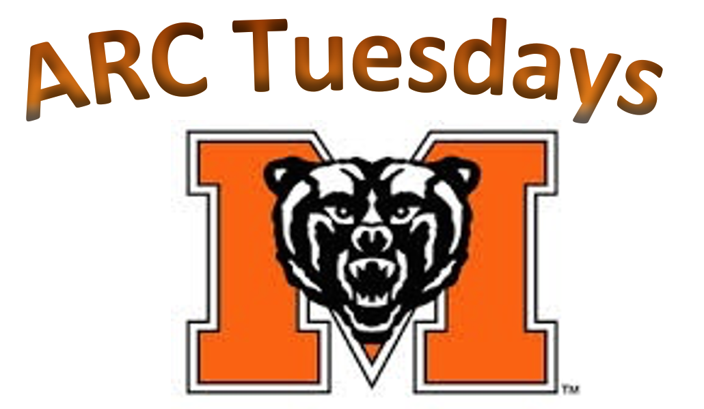

```{r setup, include=FALSE}
knitr::opts_chunk$set(echo = FALSE)
```

<style type="text/css">
* {
  font-family: Avenir;
}

.title {
  display: none;
}

.center {
  text-align: center;
}

.centertb {
  margin-left: auto;
  margin-right: auto;
}

table, th, td {
  border: 0px solid black;
  padding-bottom: 8px;
}
</style>

<div class="center">

{width="30%"}

### Click an hourly link to ask questions on Zoom! 

<table style="width:70%; font-size:28px;" class="centertb">
  <tr>
    <td>9 -- 10 a.m.</td>
    <td>**_Professors Hartfield and Howard_**</td>
  </tr>
  <tr>
    <td>10 -- 11 a.m.</td>
    <td>**_Professors Yackel and Denny_**</td>
  </tr>
  <tr>
    <td>11 -- Noon</td>
    <td>[**_Professors Symington and Lu_**](https://mercer.zoom.us/j/4783012799)</td>
  </tr>
  <tr>
    <td>Noon -- 1 p.m.</td>
    <td>**_Professors Symington and Nepal_**</td>
  </tr>
  <tr>
    <td>1 -- 2 p.m.</td>
    <td>**_Professors McIlwain and Holloway_**</td>
  </tr>
  <tr>
    <td>2 -- 3 p.m.</td>
    <td>**_Professors Troupe and Pullen_**</td>
  </tr>
</table>

<br>

{width="40%"}

</div>
